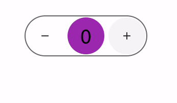

<!--
This README describes the package. If you publish this package to pub.dev,
this README's contents appear on the landing page for your package.

For information about how to write a good package README, see the guide for
[writing package pages](https://dart.dev/guides/libraries/writing-package-pages).

For general information about developing packages, see the Dart guide for
[creating packages](https://dart.dev/guides/libraries/create-library-packages)
and the Flutter guide for
[developing packages and plugins](https://flutter.dev/developing-packages).
-->

Number Counter that slides, inspired on [This Dribbble shot by Ehsan Rahimi](https://dribbble.com/shots/16434514-Tally-Counter-Micro-Interaction), and based on Material Design.

[Here you can test it live](https://briancraig.github.io/counter_slider/)

  

## Features

 - min and max values
 - border and sizing customizable

## Getting started

Prequisites: flutter v3.0.0.

install with
```bash
flutter pub get counter_slider
```

## Usage

```dart
CounterSlider(
    value: value,
    setValue: setValue,
    width: 256,
    height: 64,
    slideFactor: 1.4,
)
```

## Additional information

no additional information